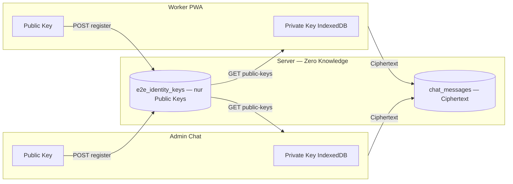

# SUPPIX — End-to-End-Verschlüsselung (E2E)

## Ausgangslage (Stand 2026-07)

| Schicht | Heute | Ziel E2E |
|---------|-------|----------|
| Transport | HTTPS/TLS | ✅ bleibt Pflicht |
| Server at-rest (Chat) | Optional Fernet (`BAUPASS_FIELD_ENCRYPTION_KEY`) — **Server kann lesen** | Nur Ciphertext; Server **kann nicht** entschlüsseln |
| Chat | Klartext oder Fernet | E2E mit Public/Private Key |
| Urlaub, Dokumente, Verträge | TLS + DB | Phasenweise E2E für sensible Felder |
| Private Keys | — | **Niemals** an Server senden oder speichern |

> **Wichtig:** At-rest-Fernet ist **kein** E2E. Der Betreiber mit DB-Zugriff kann entschlüsseln. E2E bedeutet: nur Endgeräte der Beteiligten halten die Private Keys.

---

## Sicherheitsprinzipien

1. **Private Keys verlassen das Gerät nie** — weder per API, WebSocket noch Log.
2. **Public Keys only** — Server speichert nur SPKI (X25519), zur Schlüsselfindung.
3. **Forward secrecy (Phase 2)** — Ephemeral Keys pro Nachricht (bereits in v1-Envelope vorgesehen).
4. **Zero trust server** — Server speichert und leitet nur Ciphertext (`e2e:v1:…` JSON).
5. **Gerätebindung** — Private Keys in IndexedDB, lokal mit Geräte-Masterkey verschlüsselt (Web Crypto AES-GCM).
6. **Kein Key-Escrow** — Verlust des Geräts = Verlust alter Nachrichten (Recovery nur über neue Keys + Hinweis).

---

## Kryptografie-Stack (v1)

| Baustein | Algorithmus |
|----------|-------------|
| Identität | X25519 (Web Crypto `ECDH`, Curve25519) |
| Schlüsselableitung | HKDF-SHA-256 |
| Nachricht | AES-256-GCM |
| Envelope | JSON `{ e2e, v, alg, epk, iv, ct }` |
| Anhänge (Phase 2) | Gleiches Schema, Blob = Ciphertext |

**Envelope-Beispiel (im `body`-Feld der Chat-API):**

```json
{
  "e2e": true,
  "v": 1,
  "alg": "X25519-AES-GCM",
  "epk": "<base64 ephemeral public key SPKI>",
  "iv": "<base64 12-byte nonce>",
  "ct": "<base64 ciphertext>"
}
```

---

## Architektur



---

## API (Foundation — implementiert)

| Methode | Pfad | Beschreibung |
|---------|------|--------------|
| `PUT` | `/api/e2e/identity/me` | Eigenen **Public Key** registrieren/rotieren |
| `GET` | `/api/e2e/identity/me` | Eigenen registrierten Public Key |
| `GET` | `/api/e2e/identity/public-keys` | Public Keys für Chat-Partner (Worker ↔ Firma) |

**Verboten in allen Requests:** `privateKey`, `private_key`, `secretKey`, PEM mit `BEGIN PRIVATE`.

---

## Rollout-Phasen

### Phase 1 — Chat E2E (Priorität)
- [x] Foundation: `e2e-crypto.js`, Identity-API, DB-Tabelle
- [x] Worker-PWA: Key erzeugen bei Login, Nachrichten verschlüsseln
- [x] Admin Chat: Key erzeugen, entschlüsseln beim Anzeigen
- [x] Klartext-Fallback für alte Nachrichten + Migrationshinweis
- [ ] Feature-Flag pro Firma: `e2e_chat_enabled`

### Phase 2 — Anhänge & Forward Secrecy
- [ ] Chat-Anhänge clientseitig verschlüsselt hochladen
- [ ] Optional Double-Ratchet (Signal-Protokoll) für Perfect Forward Secrecy
- [ ] Key-Rotation UI

### Phase 3 — Weitere Domänen
- [ ] Urlaubsanträge (Freitext + KI-Vorschläge)
- [ ] Dokumenten-Metadaten / sensible Notizen
- [ ] Vertrags-Entwürfe (optional getrennte Vertragsschlüssel)

### Phase 4 — Mobile Native
- [ ] Flutter: Android Keystore / iOS Secure Enclave (analog HCE-Companion)
- [ ] Key-Sync **nicht** über Server — pro Gerät eigene Identity oder QR-Transfer

---

## Was der Server weiterhin darf (Metadaten)

Ohne E2E-Inhalt lesbar zu können, sind für Routing/Zustellung nötig:

- Thread-ID, Worker-ID, Company-ID, Zeitstempel
- Sender-Typ (admin/worker), Read-Status
- Push-Titel generisch („Neue Nachricht“) — **ohne** Klartext

---

## Betrieb & Compliance

- `BAUPASS_FIELD_ENCRYPTION_KEY` bleibt sinnvoll für **Legacy-Klartext** und Nicht-E2E-Spalten.
- Backups: DB enthält nur Ciphertext — ohne Private Keys wertlos für Inhalt.
- Pen-Test-Fokus: API darf Private Keys ablehnen; Envelope-Injection; Key-Substitution.
- DSGVO: E2E reduziert Server-Verantwortung für Inhaltskenntnis (Metadaten bleiben).

---

## Client-Integration (Kurz)

```html
<script src="/e2e-crypto.js"></script>
```

```javascript
await window.E2ECrypto.init();
const identity = await window.E2ECrypto.ensureLocalIdentity("worker", workerId);
await window.E2ECrypto.registerPublicKey("/api/e2e/identity/me", identity.publicKeySpkiB64);

const recipients = await fetchPublicKeysForThread(threadId);
const body = await window.E2ECrypto.encryptUtf8("Hallo", recipients);
// body = JSON string → chat API POST
```

Siehe auch: [`docs/SECURITY-MODEL-AR.md`](SECURITY-MODEL-AR.md), [`backend/app/platform/security/e2e_identity.py`](../backend/app/platform/security/e2e_identity.py).
