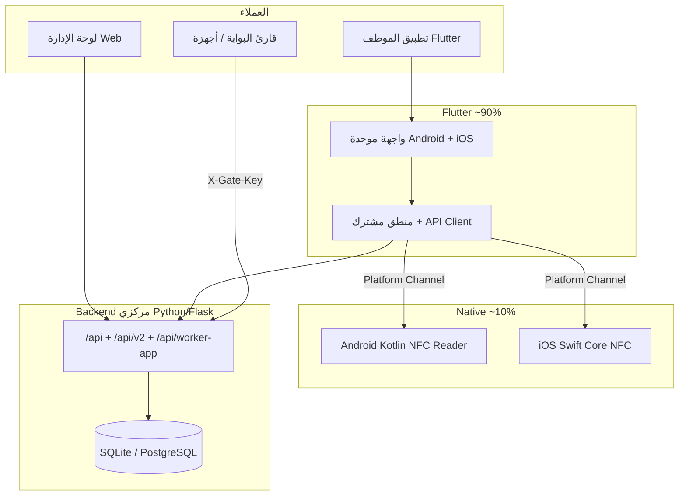

# BauPass — منصة Enterprise Hybrid

معمارية موحّدة: **Backend مركزي** + **لوحة إدارة ويب** + **تطبيق موظف Hybrid (Flutter ~90% / Native NFC ~10%)**.

## نظرة عامة



## 1. Backend مركزي (مصدر الحقيقة)

| مجال | مسارات رئيسية | حالة المستودع |
|------|---------------|---------------|
| مصادقة إدارة | `/api/login`, sessions, 2FA | ✅ `backend/server.py` + `domains/auth` |
| مصادقة موظف | `/api/worker-app/login`, sessions | ✅ |
| موظفون | `/api/workers`, `/api/v2/workers` | ✅ + استخراج تدريجي إلى domains |
| حضور | `access_logs`, gates, scan | ✅ |
| NFC موظف | `POST /api/worker-app/attendance/nfc` | ✅ |
| NFC بوابة | `POST /api/scan`, `/api/gates/tap` | ✅ |
| أجهزة | device ingest, turnstile API keys | ✅ |
| سجلات / تدقيق | `log_audit`, observability | ✅ |
| فوترة / إشعارات | domains scaffold | 🟡 |

**تشغيل:** `backend/server.py`, `backend/entrypoint.py`, Railway workflow.

**قاعدة بيانات:** انتقال Postgres عبر `backend/app/db/`.

## 2. لوحة تحكم الإدارة (Web)

| وظيفة | التنفيذ الحالي |
|--------|----------------|
| إدارة موظفين | `app.js` + `/api/workers` |
| تقارير حضور | access logs, PDF, dashboards |
| صلاحيات RBAC | superadmin, company-admin, … |
| أجهزة / بوابات | turnstile users, gate config |
| تعيين بطاقة NFC | `physicalCardId` على الموظف |

**مسارات:**

- **Legacy (كامل):** `index.html`, `app.js`
- **Admin v2 (خفيف):** `admin-v2/index.html` → `/api/v2/admin/overview`, `/api/v2/workers`, `/api/v2/access/live`

## 3. تطبيق الموظف Hybrid — Flutter (مختار)

> **Flutter** (وليس React Native) — كود واحد لـ Android و iOS، Platform Channels للـ NFC فقط.

### طبقة مشتركة (~90%)

```
mobile/lib/
  core/           config, api_client, auth_repository
  services/       nfc_service, attendance, offline queue, cache
  features/
    auth/         Badge-ID + PIN + رابط دخول
    shell/        تنقل موحّد (حضور / ملف / رئيسية)
    attendance/   زر NFC + offline queue
    profile/      بيانات /me
    home/         لوحة مختصرة
    tasks/        placeholder (مهام لاحقاً)
```

### طبقة Native (~10%)

| منصة | تقنية | ملف |
|------|--------|-----|
| Android | Kotlin, `NfcAdapter` Reader Mode | `mobile/android/.../NfcReaderPlugin.kt` |
| iOS | Swift, Core NFC | `mobile/ios/Runner/NfcReaderPlugin.swift` |

**قناة الربط:** `com.baupass.worker/nfc` → `isAvailable`, `scanTag` → `{ uid }`.

### تدفق تسجيل الحضور

```
ضغط "تسجيل حضور"
  → Platform Channel → Native يفتح جلسة NFC
  → UID → Flutter
  → POST /api/worker-app/attendance/nfc (أو طابور offline)
  → access_logs
```

### بدون إنترنت على الهاتف

راجع [worker-attendance-fallback-AR.md](./worker-attendance-fallback-AR.md):

1. **بطاقة على قارئ البوابة** (الأولوية)
2. **طابور على الهاتف** + `offline-events` نوع `nfc_attendance`

## 4. قرارات Enterprise

| قرار | الاختيار |
|------|----------|
| تطبيق موحّد | Flutter |
| NFC على الهاتف | Native فقط (Core NFC / Android NFC) |
| هوية موظف يومية | Badge-ID + PIN |
| حضور بدون شبكة هاتف | قارئ بوابة + بطاقة física |
| توسع API | domains + `/api/v2` |

## 5. خارطة طريق مختصرة

| مرحلة | محتوى | حالة |
|-------|--------|------|
| A | Backend حضور NFC + offline replay | ✅ |
| B | Flutter scaffold + NFC native | ✅ |
| C | Badge login + shell + profile | ✅ |
| D | إشعارات FCM/APNs | 🟡 تهيئة + `/api/device/register` (يتطلب Firebase) |
| E | مهام / إجازات + مستندات في التطبيق | ✅ |
| F | Admin SPA على v2 | ✅ `admin-v2/` + `GET /api/v2/admin/overview` |

## 6. التوزيع (مرحلة أولى: داخلي — ليس متجراً عاماً فوراً)

| منصة | المرحلة 1 (موصى بها الآن) | المرحلة 2 (لاحقاً) |
|------|---------------------------|---------------------|
| Android | APK داخلي / رابط / MDM — CI: `flutter-worker-apk.yml` | Google Play أو Enterprise |
| iPhone | **TestFlight** للموظفين والاختبار | App Store أو Apple Business Manager |

**لماذا:** تسريع NFC والتحديثات دون انتظار مراجعة المتجر؛ بعد الاستقرار يُختار النشر العام أو الاستمرار داخلياً.

- NFC: قراءة UID فقط — **بدون** محاكاة بطاقة (HCE) في تطبيق الموظف → لا حاجة لموافقة Apple خاصة بالدفع.
- PWA (`emp-app.html`) تبقى legacy؛ التطبيق الرسمي للحضور NFC هو **Flutter**.

راجع: [enterprise-hybrid-mobile-architecture.md](./enterprise-hybrid-mobile-architecture.md) (إنجليزي — مرجع رسمي).

## 7. مفاتيح الخادم + iPhone

- [iphone-testflight-railway-AR.md](./iphone-testflight-railway-AR.md) — قائمة متغيرات Railway + TestFlight
- [`.env.worker-mobile.example`](../.env.worker-mobile.example) — قالب نسخ
- `GET /api/worker-app/mobile-setup` — فحص الجاهزية (بدون أسرار)

## 8. مراجع

- [worker-mobile-nfc-api.md](./worker-mobile-nfc-api.md)
- [worker-attendance-fallback-AR.md](./worker-attendance-fallback-AR.md)
- [architecture-qr-nfc-wallet-tiers.md](./architecture-qr-nfc-wallet-tiers.md)
- [distribute-worker-app-AR.md](./distribute-worker-app-AR.md)
- [mobile/README.md](../mobile/README.md)
