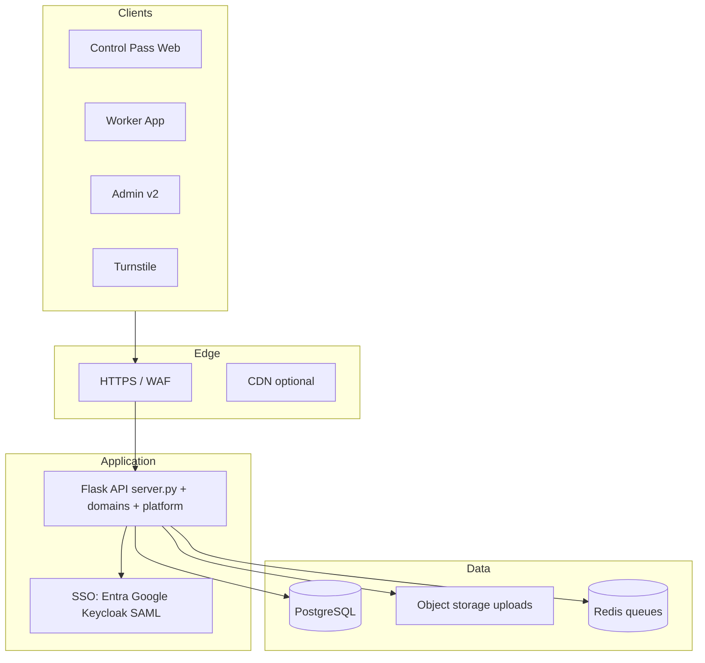

# Security Architecture — BauPass (ملخص)

## مبادئ

- **عزل المستأجر:** `company_id` في كل استعلام حساس
- **أقل صلاحية:** RBAC + أدوار مؤسسية تدريجياً
- **تشفير النقل:** TLS إلزامي
- **أسرار:** Env / Key Vault — لا في Git
- **تدقيق:** `audit_logs` + تصدير PDF

## Trust boundaries

| Zone | وصف |
|------|-----|
| Public internet | متصفحات العملاء |
| App tier | API + workers |
| Data tier | PostgreSQL, Redis, blobs |
| IdP | Entra / Keycloak / SAML IdP |
