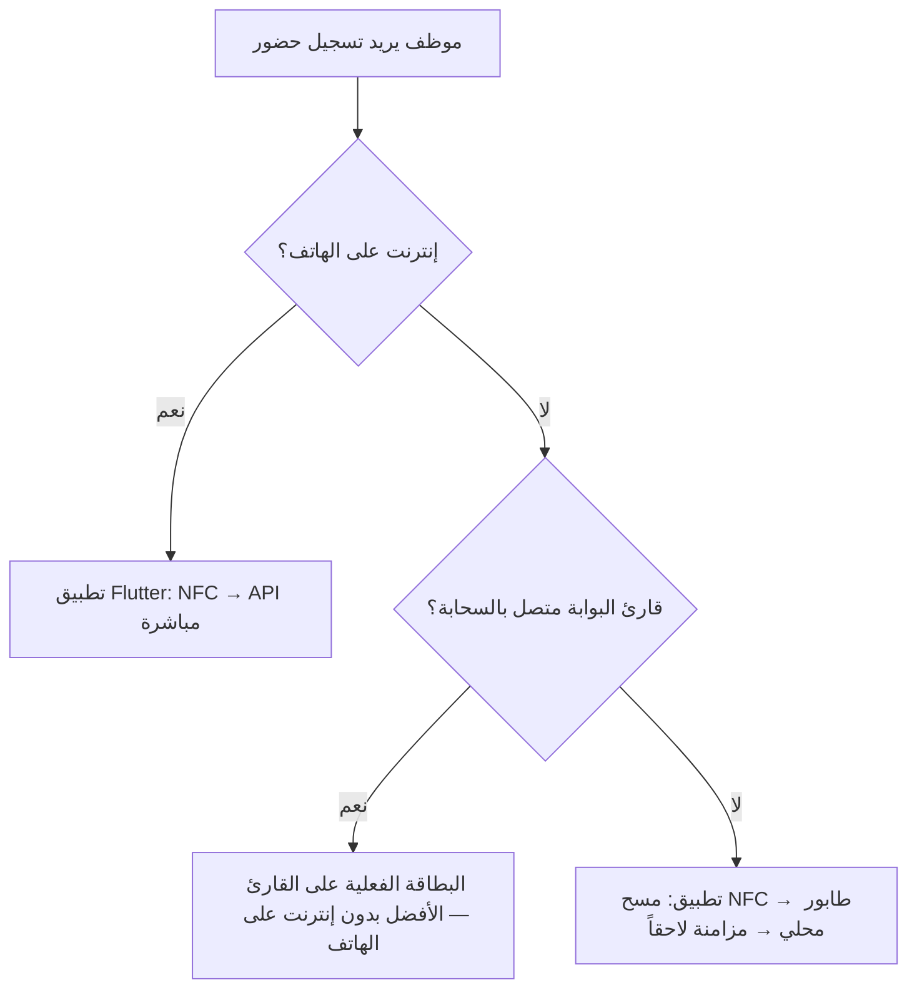

# حضور الموظف — استراتيجية عدم الاتصال والبدائل

## المبدأ

لا يوجد حل واحد يغطي كل الحالات. نستخدم **ثلاث مستويات** حسب ما يتوفر في الميدان.



## المستوى 1 — البطاقة عند القارئ (موصى به عند انقطاع إنترنت الهاتف)

| العنصر | الوصف |
|--------|--------|
| ماذا يحتاج الموظف | بطاقة NFC/RFID مسجّلة (`physicalCardId`) |
| ماذا يحتاج الموقع | قارئ بوابة متصل بالإنترنت → BauPass API |
| API | `POST /api/scan` أو `POST /api/gates/tap` مع `X-Gate-Key` |
| الهاتف | **غير مطلوب** |

هذا هو البديل الأقوى عندما يفشل إنترنت الهاتف: القارئ يتحدث مع السيرفر، والبطاقة هي الهوية.

## المستوى 2 — الهاتف بدون إنترنت (طابور + مزامنة)

| الخطوة | السلوك |
|--------|--------|
| 1 | الموظف مسجّل دخولاً مسبقاً (جلسة محفوظة) |
| 2 | يمسح NFC على الهاتف (يعمل بدون شبكة) |
| 3 | التطبيق يحفظ حدثاً محلياً: `type: nfc_attendance` |
| 4 | عند عودة الإنترنت: `POST /api/worker-app/offline-events` |
| 5 | السيرفر يُنشئ `access_logs` مع وقت الحدث الأصلي `occurredAt` |

حقول الحدث في الطابور:

```json
{
  "type": "nfc_attendance",
  "clientEventId": "nfc-1730000000-123",
  "nfcUid": "04A1B2C3D4E5F6",
  "direction": "check-in",
  "occurredAt": "2026-05-27T07:15:00.000Z"
}
```

`direction` يُحدَّد **لحظة المسح** على الهاتف (وليس وقت المزامنة) لتفادي أخطاء check-in/check-out.

## المستوى 3 — QR / Badge ID (احتياطي)

- PWA الحالية تعرض QR مخزّناً offline.
- يمكن للبوابة قراءة `badgeId` كـ QR.
- تطبيق Flutter يعرض `badgeId` في شاشة الحضور كتذكير: استخدم البطاقة على القارئ.

## ما لا يُنصح به

| سيناريو | السبب |
|---------|--------|
| الاعتماد على الهاتف فقط بدون بطاقة مسجّلة | لا يوجد `physicalCardId` → فشل التحقق |
| توقع أن NFC على الهاتف يصل للسيرفر بدون إنترنت | يحتاج طابور أو قارئ بوابة |
| UID البطاقة كسر وحيد للمؤسسات | وثّق في `docs/nfc-wallet-plan.md` — عزّز لاحقاً |

## التنفيذ في المستودع

| جزء | مسار |
|-----|------|
| حضور مباشر | `POST /api/worker-app/attendance/nfc` |
| مزامنة offline | `POST /api/worker-app/offline-events` + نوع `nfc_attendance` |
| Flutter طابور | `mobile/lib/services/offline_attendance_store.dart` |
| واجهة الموظف | `mobile/lib/features/attendance/attendance_screen.dart` |

## توصية تشغيلية للشركات

1. **أصدر بطاقة NFC** لكل موظف دائم + سجّل UID في الأدمن.
2. **ثبّت قارئاً على البوابة** متصلاً بالسحابة (البديل الرئيسي بدون إنترنت على الهاتف).
3. **فعّل تطبيق الموظف** للحضور الإضافي والمزامنة عند ضعف الشبكة على الهاتف فقط.
